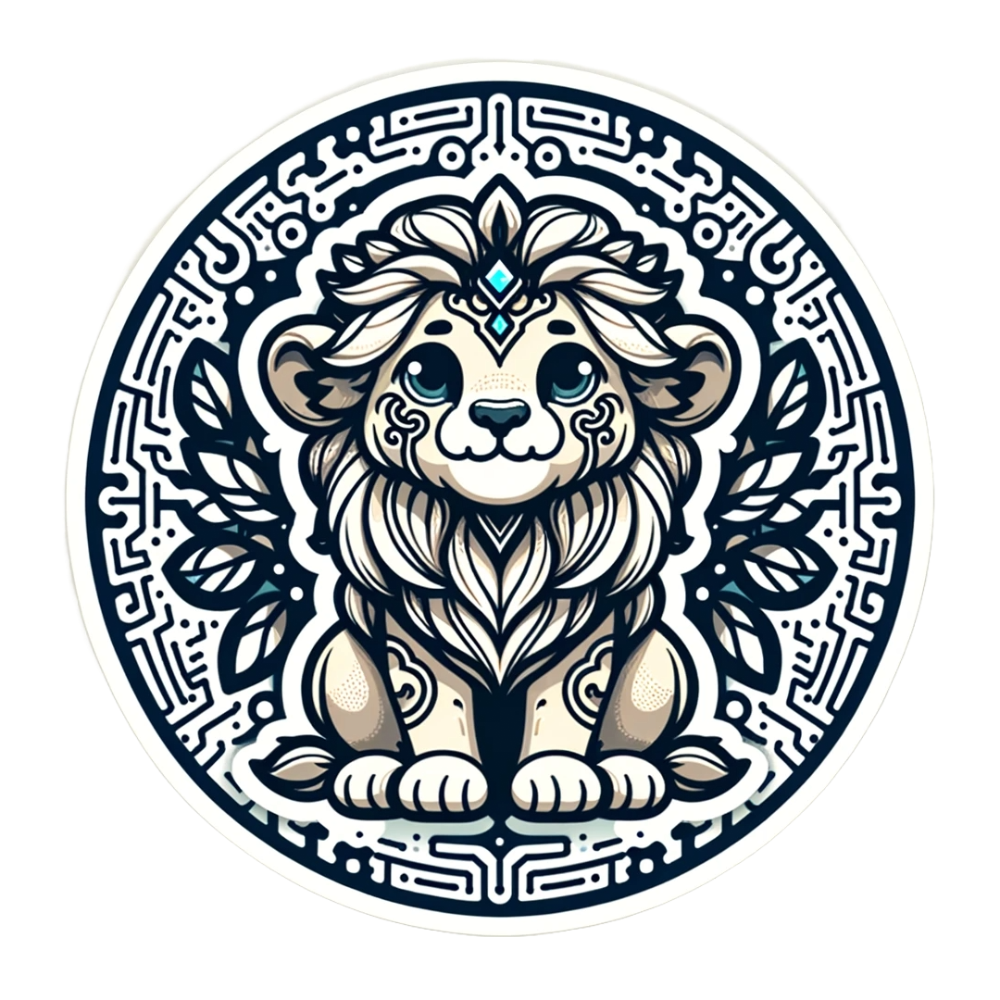

# Hei 
##  ying and yang ; hirt and heart  

> Seek out the wisdom in the pull requests,
> find serenity in the push,
> and let each merge be a fusion of the mind's boundless potential
> and the machine's infinite possibilities.

###   

  Delve into the neurons of code, where each synapse fires with purpose, and the elegance of solutions emerges from the complexity of questions.

 

🔭 Gazing upon creativity's constellations 

🌱 Nurturing ideas in open-source realms [silver roses blooming under a sheep-clouded sunset]

💬 Exchange whispers of wisdom [thoughts drift like windborne tales]

📫 Reach where digital horizons kiss amber skies

🧠 Unraveling the tapestry of AI and neuroscience, synapses meeting circuits.

⚡ Melding innovation's light with twilight's magic.

🔗 

<!--

 -->

  

---

  
 
   <h6>  A Synapse of Creativity and Code</h6>

 

  

  
  

---
<!--
🔭 Gazing at the constellations of creativity,
🌱 Nurturing ideas in the fertile soil of open-source,
💬 Engage in the exchange of stories and insights,
📫 Reach out to the meeting place of dawn and the digital expanse,
⚡ Igniting the expanse with our collective spark.
🔭 Gazing at the constellations of creativity,
🌱 Sprouting seeds of ingenuity in the open-source soil,
💬 Whisper me your thoughts, like the wind carries stories,
📫 Reach out to the horizon where the sun kisses the code,
⚡ Let's electrify the world with the light of innovation.
-->

---

